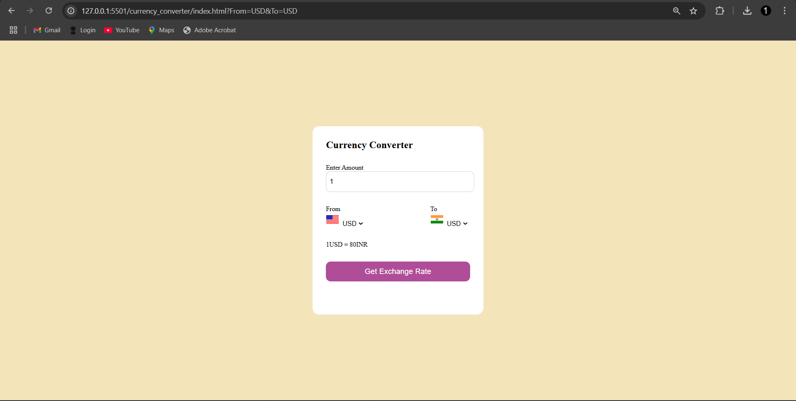
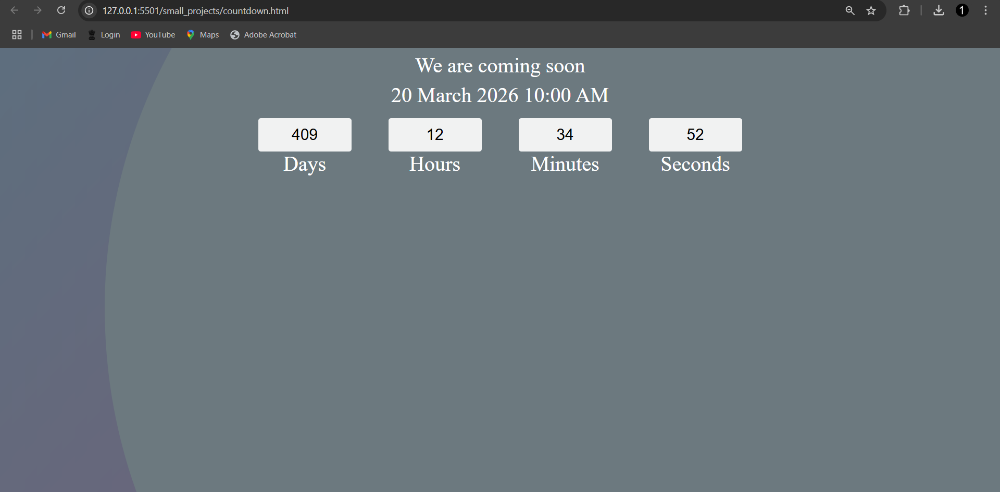
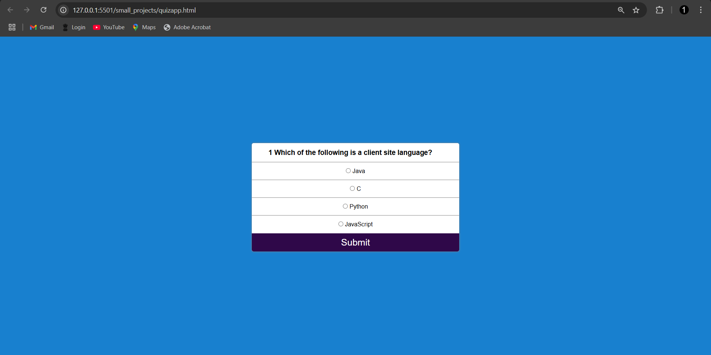
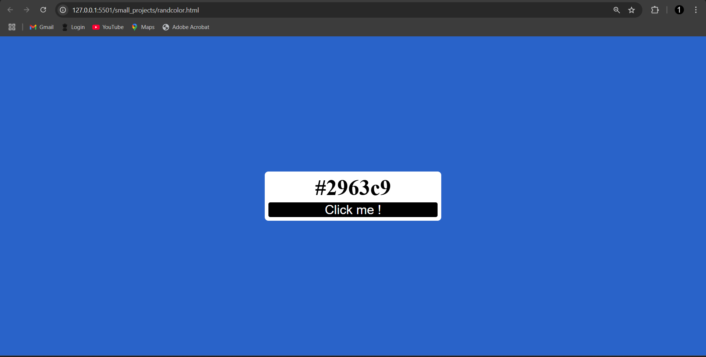

# Javascript-utilities
A collection of essential JavaScript utilities, including a currency converter, countdown timer, quiz game, random color generator, and password generator. Perfect for learning and quick prototyping.

## Projects Included

1. **Currency Converter**  
   Convert between different currencies using real-time exchange rates.
   

2. **Countdown Timer**  
   Set a timer to count down to a specific date and time.
   

3. **Quiz Game**  
   A fun, interactive quiz with multiple-choice questions.
   

4. **Random Color Generator**  
   Generate random colors with hex codes for design inspiration.
   

5. **Password Generator**  
   Create strong, random passwords with customizable options.
   

## How to Use

1. Clone the repository:
   ```bash
   git clone https://github.com/yourusername/javascript-utilities.git
   ```

2. Navigate to the project folder:
   ```bash
   cd javascript-utilities
   ```

3. Open the desired project folder and run the HTML file in your browser.

## Technologies Used

- HTML5
- CSS3
- JavaScript (ES6+)

## Contributing

Feel free to fork this repository, make improvements, and submit pull requests. All contributions are welcome and suggestions are accepted!

---

Happy Coding! 🚀

